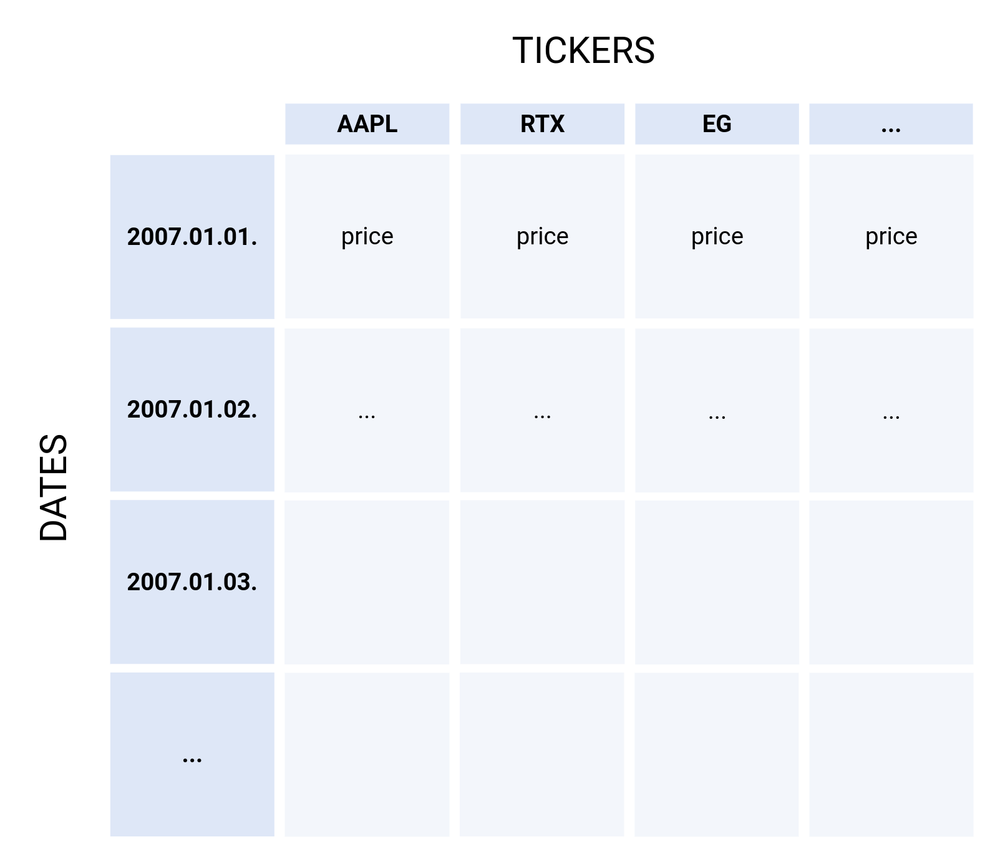
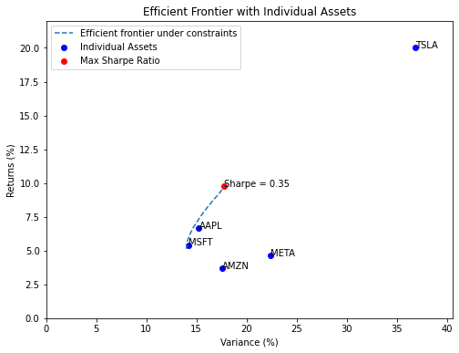
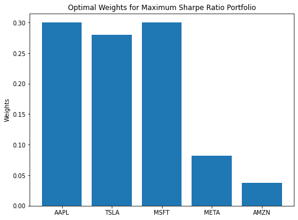

Welcome to Portfolio Optimizer's documentation!
===============================================

This project implements the simple Markowitz portfolio optimization model.
It is the foundation of modern portfolio theory.

The assumptions of the model are:

#. Risk of a portfolio is based on the variability of returns from said portfolio.
#. An investor is risk averse.
#. An investor prefers to increase consumption.
#. The investor's utility function is concave and increasing, due to their risk aversion and consumption preference.
#. Analysis is based on single period model of investment.
#. An investor either maximizes their portfolio return for a given level of risk or minimizes their risk for a given return.
#. An investor is rational in nature.

More information on theory and calculations can be found on:
https://en.wikipedia.org/wiki/Modern_portfolio_theory

The algorithm needs a timestamped dataset of stock prices,
which can be obtained from Yahoo Finance, Google Finance or other sources.
A sample table structure is as follows:

The algorithm will provide the efficient frontier visually,

and the optimal portfolio weights numerically:

.. toctree::
   :maxdepth: 2
   :caption: Contents:

Requirements:
==================
numpy==1.26.3
pandas==2.1.4
matplotlib==3.8.1
scipy==1.11.4

Documentation:
==================
https://portfolio-optimizer.readthedocs.io/en/latest/

Source:
==================
https://github.com/SirArthur100/scientific_python

Indices and tables
==================

* :ref:`genindex`
* :ref:`modindex`
* :ref:`search`

.. Hidden TOCs

.. toctree::
   :maxdepth: 2
   :hidden:
   :caption: Introduction
   
   how_to
   optimizer

.. toctree::
   :maxdepth: 2
   :hidden:
   :caption: Source

   modules
